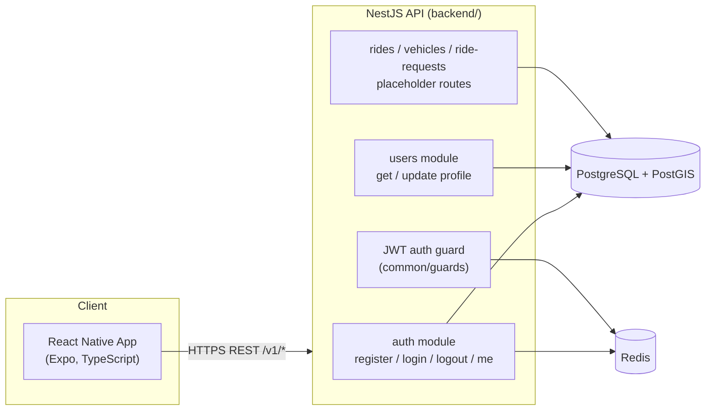
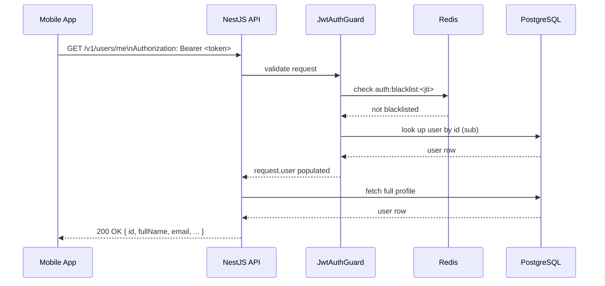

# System Architecture — Month 1 Foundation

## Overview

## Layers

1. **Mobile app (React Native + Expo, TypeScript)** — the only client in Month 1. Talks to the
   API exclusively over REST (`MOBILE_API_URL` / `EXPO_PUBLIC_API_URL`).
2. **NestJS API** — a single deployable service, versioned at `/v1`. Modules map 1:1 to the
   folder structure in `backend/src/`: `auth`, `users`, `vehicles`, `rides`, `ride-requests`,
   `database`, `redis`, and `common` (guards, filters, interceptors, decorators, DTOs).
3. **PostgreSQL + PostGIS** — the single source of truth. All persistent entities (`users`,
   `vehicles`, `rides`, `ride_requests`) live here. Ride pickup/destination points use PostGIS
   `geography(Point, 4326)` columns with GIST indexes so spatial "nearby rides" queries can be
   added later without a schema change.
4. **Redis** — temporary data only. In Month 1 it backs the JWT logout blacklist (a token's
   `jti` is stored with a TTL equal to its remaining lifetime). It is reserved for OTP expiry
   and rate-limiting in later months, per the architecture rules below.

## Architecture rules

1. PostgreSQL is the permanent source of truth.
2. Redis stores temporary data only (OTP codes, rate-limit counters, cache entries, the logout
   token blacklist).
3. PostGIS geography fields are used now so future ride matching can use location-based queries
   without new migrations.
4. All protected APIs require a valid JWT, enforced by `JwtAuthGuard` (`common/guards`).
5. All request data is validated on the backend via `class-validator` DTOs and a global
   `ValidationPipe` (whitelist + forbid unknown properties + 422 on failure).
6. Passwords are stored only as bcrypt hashes (`bcryptjs`), never in plain text or reversible
   form.
7. Secrets (JWT signing key, DB/Redis URLs) are supplied only via environment variables —
   see `.env.example`.
8. API responses never include `password_hash`, refresh tokens, or other internal fields; the
   `PublicUserDto` mapping (`users/users.mapper.ts`) is the only shape returned for a user.

## Request lifecycle (protected endpoint)

## Deployment topology (local, Month 1)

Docker Compose runs three services: `api`, `postgres` (PostGIS-enabled image), and `redis`.
The API container runs pending migrations on startup, then serves traffic on port 3000.
Production cloud deployment is explicitly out of scope for Month 1.
