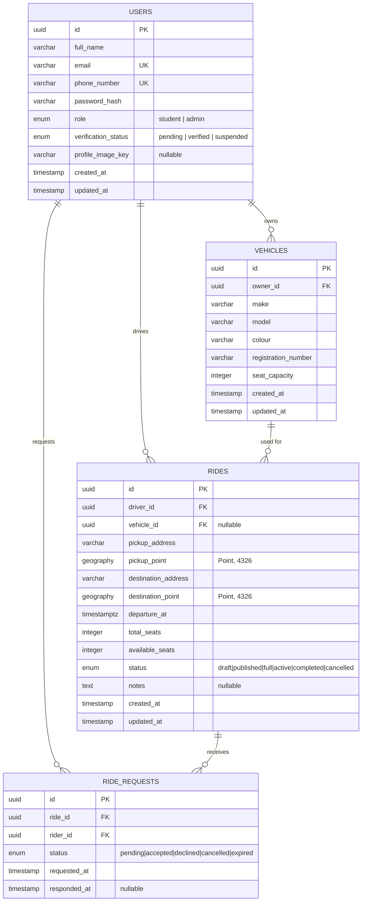

# Entity Relationship Diagram — Month 1 Foundation

## Notes

- `vehicles`, `rides`, and `ride_requests` are created by migrations in Month 1 for future use;
  only `users` has application-level CRUD (registration, profile) in this phase.
- `rides.pickup_point` / `rides.destination_point` are indexed with PostGIS GIST indexes to
  support future "rides near me" queries.
- Check constraints on `rides` enforce `total_seats > 0`, `available_seats >= 0`, and
  `available_seats <= total_seats` at the database level.
